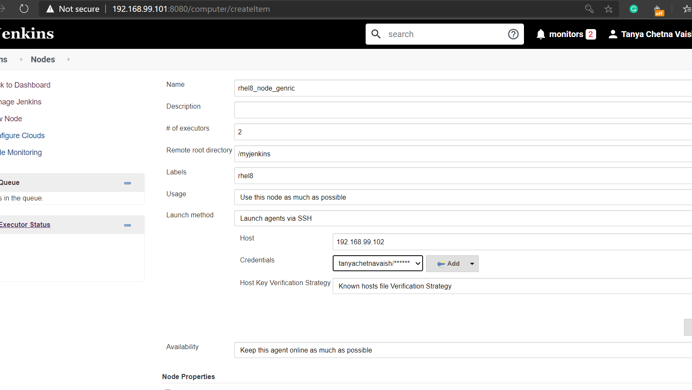
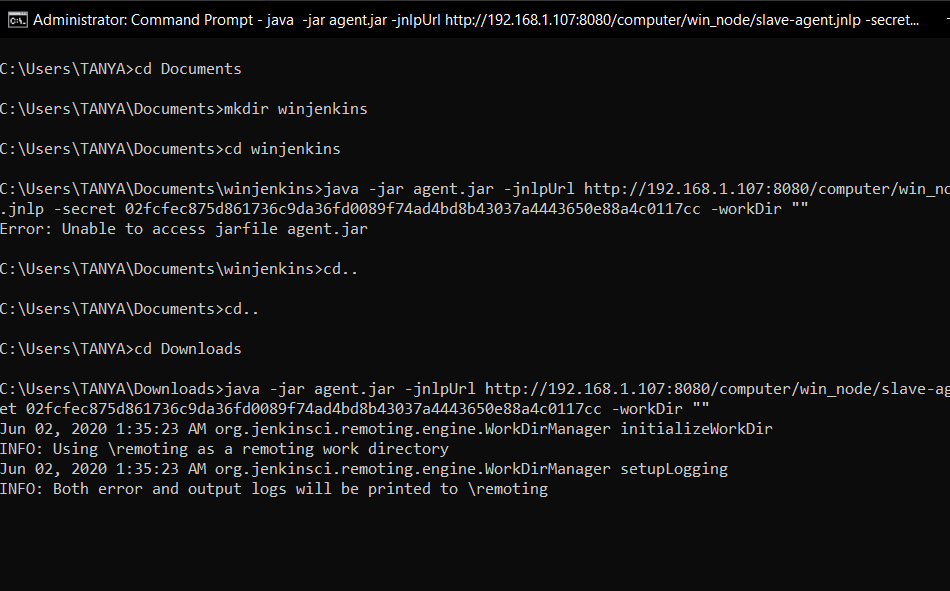

# DYNAMIC DISTRIBUTED CLUSTER IN JENKINS
***In Jenkins,we have capability to create distributed cluster.The system that provides resources is called Slave/Worker.Jenkins on MASTER-SLAVE Architecture.In Jenkins we can create two types of cluster: Static and Dynamic.Slave/worker must have Java installed and network connectivity.Here I will use 3 slaves,in which 2 will be static and one dynamic.In RHEL8 we will use ssh connectivity,but in Windows we will use JNLP connectivity. ***

ASSUMPTIONS
```
The slave machine must have java installed and have network connectivity.Yum must be configured.Jenkins should be installed and configured with the required plugins for the pipeline.
```

**STEPS**

1- Create Jenkins Server on Master machine.Run "systemctl status jenkins " command to check the status of Jenkins in your system.Here the IP of my Jenkins Server machine is 192.168.99.101


2- Launch the slave node.Here its IP is 192.168.99.102.


My slave machine also has Java installed.With network connectivity


Master can connect with the slave machine using ssh


3-My windows is going to be the second slave.It also has JAVA installed.


4- To add new slave: Jenkins--->Manage Jenkins--->Manage Nodes and Clouds


Here there is only our master node where our Jenkins server is running


To add rhel8 as slave, go to add new node then set name of the node and make it a permanent agent


Create a directory in the slave 1 machine and add its path to Remote Root Directory.Also provide the creditials.Make it a Non-Verifying Strategy.Save it!



Now one can see another node added


5-In Windows through Command Prompt make a directory.Which will be added to Remote Root Directory.


And similarly add this node and save it.However this node isnt active because it need connectivity,JNLP has to be set up.


6-In Configure Global Security,update TCP port for Inbound as Random.


Go to the win_node and download the given agent.jar file.And run the follwoing command on CLI.Make sure the agent.jar file is in the same location where you run this command


Here this command will contain the initial IP of Jenkins with which it was installed.


So update it with your real-time IP


Thus JNLP connection is established.

